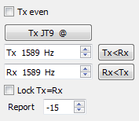

// Status=review

At the center of the main window are a number of controls used when
making QSOs:

//.Misc Controls Center

* Check *Tx even* to transmit in even-numbered UTC minutes.  Uncheck
this box to transmit in the odd minutes.  This selection is made
automatically when you double-click on a decoded text line, as
described in the <<X5,Basic Operating Tutorial>>.

* The Tx and Rx audio frequencies are usually set automatically by
double-clicking on decoded text or a signal in the waterfall.  They 
can also be adjusted with spinner controls. 

* You can force Tx frequency to the current Rx frequency by clicking
the *Tx<Rx* button, and vice-versa for *Rx<Tx*.  (Copy is from right
to left.)  Check the box *Lock Tx=Rx* to make the frequencies always
track one another.  The on-the-air frequency of your lowest JT9 or
JT65 tone is the sum of dial frequency and audio Tx frequency.

* The *Report* control lets you change a signal report that has been
inserted automatically. Most reports will fall in the range –26 to +10
dB.  Remember that JT65 reports saturate at an upper limit of -1
dB.

IMPORTANT: When signals are close to or above 0 dB, you and your QSO
partner should probably reduce power. JT65 and JT9 are supposed to be
weak signal modes!

