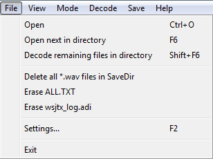
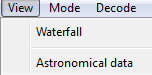
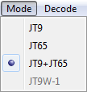
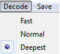
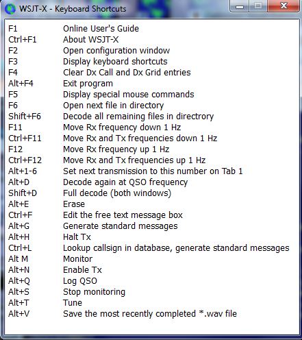

// Status=review

Program menus offer many options for configuration and operation.
Most of the items are self-explanatory; a few additional details are
provided below.  Keyboard shortcuts for some frequently used menu
items are listed at the right.

[[FILE_MENU]]
==== File menu

==== WSJT-X menu
image::images/MacAppMenu.png[align="left",alt="Mac App Menu"]

On Macintosh, *Settings* (otherwise found on the *File* menu) appears
here instead, labeled as *Preferences*, and *About WSJT-X* appears
here rather than on the *Help* menu.

[[VIEW_MENU]]
==== View Menu

[[MODE_MENU]]
==== Mode Menu

[[DECODE_MENU]]
==== Decode Menu

[[SAVE_MENU]]
[[SAVE-WAV]]
==== Save Menu
image::images/save-menu.png[align="left",alt="Save Menu"]

Choose *Save all* to save received data as audio +.wav+ files.
*Save decoded* will save only those files containing at least one 
decoded message.  

[[HELP_MENU]]
==== Help Menu
image::images/help-menu.png[align="left",alt="Help Menu"]

image::images/special-mouse-commands.png[align="left",alt="Help Menu"]
