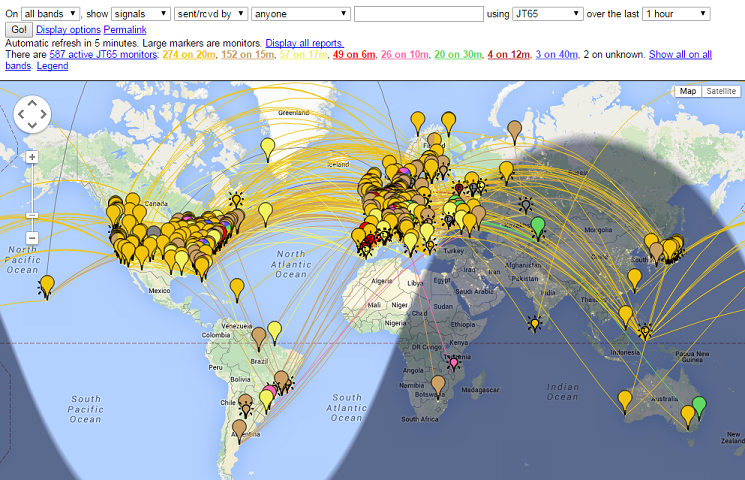
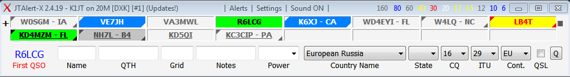

_WSJT-X_ is programmed to cooperate closely with several other useful
programs.  

* {dxlsuite} and {hrd} were described in the section on <<RADIO,rig control>>.

* {pskreporter}, by Philip Gladstone, is a web server that gathers
reception reports sent by various other programs, including _WSJT-X_.
The information is made available in near real time on a world map,
and also as statistical summaries of various kinds.  A number of
options are available to the user; for example, you can request a map
showing world-wide JT65 activity on all amateur bands over over the
past hour.  Such a map might look like this, where different colors
represent different bands:

* {jtalert}, by VK3AMA, is available only for Windows.  It provides 
many operating aids including

- automatic logging with several third-party logging programs

- audio and visual alerts on a number of optional alert conditions

- convenient direct access to various web services such as callsign lookup. 

