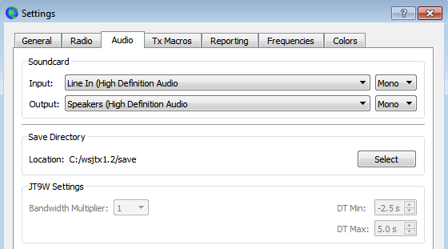

// Status=review
Select the *Audio* tab to configure your sound system.

- _Soundcard_: Select the audio devices to be used for *Input* and
*Output*.  Usually the *Mono* settings will suffice, but in special
cases you can choose *Left*, *Right*, or *Both* stereo channels.

IMPORTANT: If you select the audio output device that is also your
computer's default audio device, be sure to turn off all system sounds
to prevent transmitting them over the air.

- _Save Directory_: _WSJT-X_ can save its received audio sequences as
+.wav+ files.  A default directory for these files is provided; you
can select another location if desired.

- _JT9W Settings_: JT9W is an experimental mode designed for EME on
the microwave bands, and is not enabled in current release versions.

