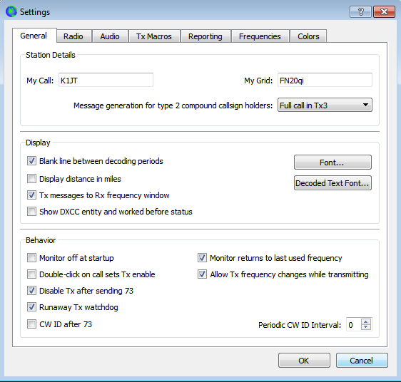

// Status=review
[[FIG_CONFIG_STATION]]

Select the *General* tab on the *Settings* window.  Under _Station
Details_, enter your call sign and 4-digit or 6-digit grid locator.
This information will be sufficient for initial tests.

Meanings of the remaining options on the *General* tab will become
self-explanatory after you have made some QSOs using _WSJT-X_.  You
may return to set these options later.

