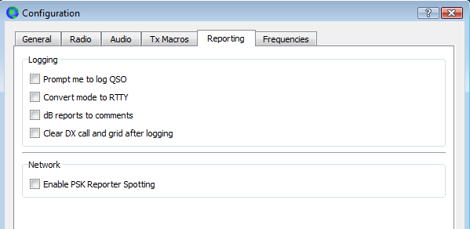

// Status=review
[[FIG_CONFIG_RPT]]

- _Logging_: Choose any desired options from this group.  For detailed
descriptions of their effects, see <<CONFIG_DETAILS,Configuration>> 
in the <<COMMAND_REF,Command Reference>> section.

- _Network_: Check *Enable PSK Reporter Spotting* to send reception
reports to the {pskreporter} mapping facility.
