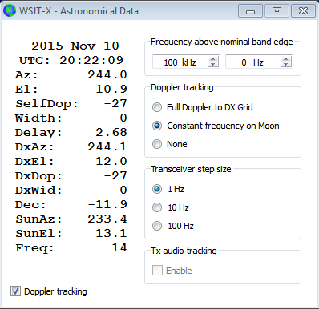

=== VHF Setup

V1.6.0 is the first _WSJT-X_ version to include features specifically
designed for use on VHF and higher bands.  These features include *JT4*,
a mode particularly useful for EME on the microwave bands; *Echo* mode,
for detecting and measuring your own lunar echoes; and automatic
*Doppler tracking* for the EME path.  (Note that sub-modes JT65B and
JT65C are present in v1.6.0, but are not yet fully implemented for EME
purposes.)

- Check the box labeled _Enable VHF/UHF/Microwave features_ on the
*Settings | General* tab to activate the VHF-and-up features.  

- If you will be doing EME, check the box _Decode at t = 52 s_
to allow for the EME path delay.

- If you will use automatic Doppler tracking, check the box 
_Allow Tx frequency changes while transmitting_.  Also select
_Split Operation_ (either _Rig_ or _Fake It_: you might need
to experiment with both) on the *Radio* tab.

IMPORTANT: Not all transceivers permit computer adjustments
of Tx frequency while transmitting.  Among those that do are the
IC735, IC756 Pro II, IC910-H, FT-847, TS-2000 (with Rev 9 firmware
upgrade), Flex 1500 and 5000, HPSDR, Anan-10, Anan-100, and KX3.

- When operating in appropriate modes the main window will reconfigure
itself to include controls supporting the additional features.  For
example, in JT4 mode the central part of the main window will look
something like this:

image::images/VHF_controls.png[align="center",alt="VHF Controls"]

- On the *View* menu, select *Astronomical data* to display a window
with important information for tracking the Moon and performing
automatic Doppler control.

IMPORTANT: Note that two different types of Doppler control are provided.  

- Select _Full Doppler to DX Grid_ if you know your QSO partner's locator
and he/she is not using Doppler control.

- Select _Constant frequency on Moon_ to correct for your own (one-way)
Doppler shift to or from the Moon.  If your QSO partner does the same
thing, both stations will have the required Doppler compensation.
Better still, anyone else using this option will hear both of you
without the need for manual frequency changes.  The hypothetical ``man
in the moon'' will copy all of you on the selected nominal frequency:
in the example depicted above, this is 100 kHz above the stated band
edge, e.g., 10368.100 MHz for the 10 GHz band.

- Spinner controls at top right of the Astronomical Data window let you
set a working frequency above the nominal band edge. The frequency above
band edge is the sum of these two controls (kHz + Hz).

=== EME with JT4

- Select *JT4* from the *Mode* menu.

- Select the desired submode, which determines the tone spacing.
Higher spacings are used on the higher microwave bands, to allow for
larger Doppler spreads. For example, JT4F is generally used for EME on
the 10 GHz band.

- If using a transverter, set the appropriate offset on the
*Settings | Frequencies* tab.  Offset is defined as (desired
transceiver dial reading) minus (desired on-the-air frequencty).  For
example, for a 144 MHz radio and 10368 MHz, 
offset = (144 - 10368) = -10224.000.  Right-click anywhere inside the 
_Station Information_ box, select the desired band, and enter the 
offset number.

image::images/Add_station_info.png[align="center",alt="Station information"]

- The JT4 decoder in _WSJT-X_ includes optional facilities for
averaging over successive trandmissions and correlation decoding.  Select
your desired decoding depth from the *Decode* menu.

image::images/decoding_depth.png[align="center",alt="Decoding Depth"]

- By convention, EME with JT4 can use ``short form'' messages.  To
activate automatic generation of these messages, check the box labeled
_Sh_ on the main window.

IMPORTANT: Many additional details and hints for JT4 EME operation
are available here: 
http://physics.princeton.edu/pulsar/K1JT/WSJT-X_for_JT4_v6.pdf 
(thanks to G3WDG!).
